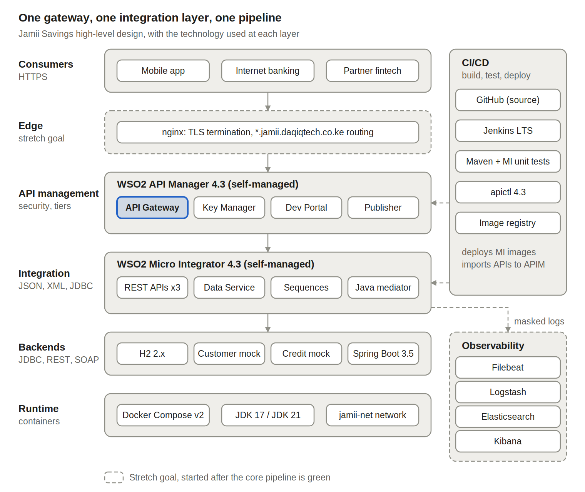
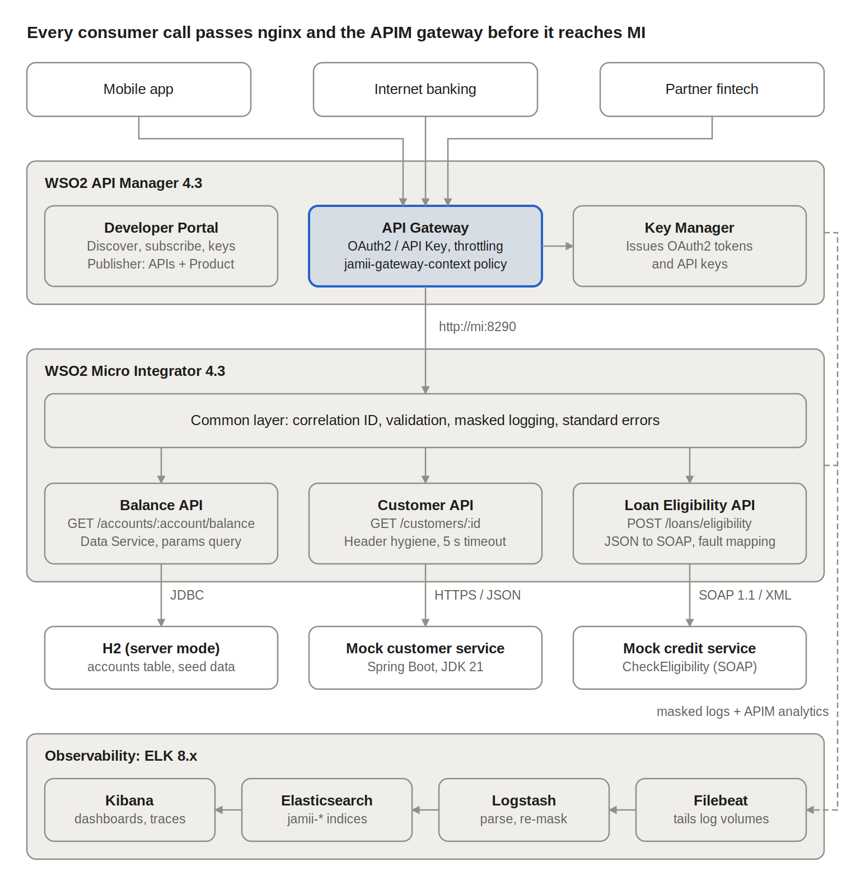

# Jamii Savings Integration Platform

Three integrations for the fictional Jamii Savings bank, built on **WSO2 Micro Integrator**, exposed and governed through **WSO2 API Manager** (both self-managed), and built and deployed by a single **Jenkins** pipeline.

| API | Method and path | Backend |
| --- | --- | --- |
| Account Balance | `GET /accounts/{accountNumber}/balance` | H2 database via MI Data Service |
| Customer Profile | `GET /customers/{customerId}` | Jamii mock customer service (Spring Boot, REST) |
| Loan Eligibility | `POST /loans/eligibility` | Jamii mock credit-check service (Spring Boot, SOAP) |

> Status: work in progress. Sections marked TODO are completed during the build.

## Quick start: everything, end to end

```bash
cp .env.example .env              # set the passwords; COMPOSE_PROFILES=core is the default stack
cd dist && sha256sum wso2mi-4.3.0.zip wso2am-4.4.0.zip > checksums.txt && cd ..
scripts/up.sh
```

`scripts/up.sh` runs `docker compose up`, which builds and starts the mock backends, H2, MI and API Manager. Once API Manager is healthy, the one-shot `apim-init` container publishes the throttling tier, the three APIs, the API Product and the demo app, then runs the gateway checks. Its exit code is the result.

A plain `docker compose up -d --build` does the same; follow progress with `docker compose logs -f apim-init`. Re-publish at any time with `docker compose run --rm apim-init`.

## Architecture





Full design: [Solution Design Document](docs/Jamii_Savings_Solution_Design_v1.4.pdf) · Requirements: [BRD](docs/Jamii_Savings_BRD_v1.4.pdf)

## Backend choices

Both non-database backends are provided by the **mock backends** in `mock-backends/`: a Spring Boot service (JDK 21, Maven, executable jar) with its own Dockerfile. It runs as the `mock-backends` service of this stack, and can also be deployed on its own with `mock-backends/docker-compose.yml`. Swagger UI: http://localhost:8081/swagger-ui.html

**Why a self-built mock instead of an existing public API.** The brief suggests existing public mock and SOAP test services. I chose to build the backends because the integration layer's value is in how it handles real behaviour, and public services cannot produce that behaviour on demand:

- **Bank-shaped data.** Customer records carry a national ID, +254 phone number and KYC status, so the masking layer is tested on the PII a bank actually holds.
- **Every failure mode, deterministically.** Specific IDs return 404, 500, a SOAP client fault, a SOAP server fault, or a delay longer than MI's timeout. Every error mapping in the BRD can be demonstrated live.
- **Leaky headers.** Responses include `Server`, `X-Powered-By` and `X-Internal-*` headers, so header stripping is proven, not assumed.
- **A meaningful SOAP contract.** `CheckEligibility` (XSD and WSDL at `/ws/creditCheck.wsdl`) is a credit-check operation, not a calculator repurposed as one.
- **No third-party outages or quotas** during the pipeline run or the recording.

The trade-off is one more service to build and run, and a deliberate departure from the "existing public" wording, which is why it is explained here.

| Backend | Endpoint | Rules |
| --- | --- | --- |
| Customer system (REST) | `GET /customers/{id}` | 1001-1005: 200; 9999: 404; 5000: 500; 5004: 7 s delay |
| Credit-check engine (SOAP 1.1) | `POST /ws` (`CheckEligibility`) | normal: decision and debt-to-income %; income 0 or customer 6000: soap:Client; customer 5000: soap:Server; customer 5004: 12 s delay |

## Architecture decisions and trade-offs

TODO (summarise ADRs 01-14 from the design doc).

## Throttling tiers

TODO: Loan Eligibility uses the custom `LoanCheck10PerMin` tier because each call depends on a slow external SOAP service with no SLA.

## How to run locally

Prerequisites: Docker with 10-12 GB RAM, JDK 21, Maven 3.9, apictl, curl, jq.

```bash
cp .env.example .env                 # set passwords and versions
# download the WSO2 zips into dist/ (see dist/README.md)
docker compose --profile core up -d --build
```

TODO: apictl import steps, token generation, sample calls.

## Run Micro Integrator locally

2. Put the MI zip in `dist/` and record its checksum: `cd dist && sha256sum wso2mi-*.zip > checksums.txt`
3. `cp .env.example .env` and set `MI_VERSION` to the version you downloaded, plus the H2 password.
4. Build and start H2 and MI with MI's port 8290 exposed for testing:
   ```bash
   docker compose -f docker-compose.yml -f docker-compose.debug.yml --profile core up -d --build h2 mi
   docker compose logs -f mi        # wait for "WSO2 Micro Integrator started"
   ```
5. Run the smoke test: `scripts/mi-smoke.sh` (add `http://localhost:8290 --with-slow` to include the 504 timeouts).

| Artifact | Purpose |
| --- | --- |
| `apis/BalanceAPI.xml` | 1a: H2 lookup via `AccountsDataService`, envelope, 400/404/503 |
| `apis/CustomerAPI.xml` | 1b: managed proxy to the mock customer system, header hygiene, 404/502/503/504 |
| `apis/LoanEligibilityAPI.xml` | 1c: JSON to SOAP `CheckEligibility` and back, fault mapping 422/502/503/504 |
| `sequences/Common_InSeq.xml` | Correlation ID (reuse or generate), start time |
| `sequences/Common_HeaderHygiene.xml` | Strips internal and server headers both ways |
| `sequences/Common_FaultSeq.xml` | Classifies timeouts, connection failures, bad JSON, other errors |
| `templates/Common_ErrorResponse.xml` | Standard error body, status, correlation header |
| `templates/Common_MaskedLog.xml` | One masked log line per stage |
| `data-services/AccountsDataService.dbs` | Parameterised query; DB settings from environment |

## Run API Manager locally

1. Put `wso2am-4.4.0.zip` in `dist/` and refresh the checksums: `cd dist && sha256sum wso2mi-4.3.0.zip wso2am-4.4.0.zip > checksums.txt`
2. Set `APIM_VERSION=4.4.0`, `APIM_ADMIN_USER` and `APIM_ADMIN_PASSWORD` in `.env`.
3. Build (the build log shows what the branding step changed), then start:
   ```bash
   docker compose build --progress=plain apim 2>&1 | grep configure:
   docker compose -f docker-compose.yml -f docker-compose.debug.yml --profile core up -d apim
   ```
4. Open the Developer Portal at https://localhost:9443/devportal and the Publisher at https://localhost:9443/publisher (self-signed certificate warning expected).

**Branding.** `docker/apim/branding/` holds the Jamii Savings theme: logos (full colour and white), favicon, landing banners, and theme overrides for the Developer Portal (`userTheme.js`), Publisher and Admin Portal (`userCustomThemes.js`). Palette: navy `#102E62`, green `#3B9B4A`, light green `#5BBE61`, dark green `#2F7F3E`, white `#FFFFFF`.

## Publish the APIs

Needs `curl`, `jq` and `apictl` 4.4 (`brew install jq`; apictl from the WSO2 API Controller download page).

```bash
scripts/apim-bootstrap.sh          # tier, 3 APIs, API Product, demo app + keys (safe to re-run)
scripts/gateway-check.sh           # end-to-end checks through the gateway
```

| Artifact | Location |
| --- | --- |
| OpenAPI 3.0 specs (shared `ErrorResponse`) | `apim/apis/*/Definitions/swagger.yaml` |
| apictl projects (security, tiers, endpoints, tile) | `apim/apis/*` |
| Gateway policy `jamiiGatewayContext` (Balance API) | `apim/apis/JamiiAccountBalance-v1/Policies/` |
| Endpoints per environment | `apim/params/{dev,prod}/*.yaml` |
| Custom tier `LoanCheck10PerMin` | `apim/throttling/` |
| API Product `JamiiRetailBanking` | `apim/products/JamiiRetailBanking/` |

| API | Security | Tiers |
| --- | --- | --- |
| JamiiAccountBalance | OAuth2 | Gold, Unlimited |
| JamiiCustomerProfile | API key | Gold, Unlimited |
| JamiiLoanEligibility | OAuth2 | LoanCheck10PerMin, Gold |
| JamiiRetailBanking (product) | OAuth2 | Gold |

Loan eligibility gets a tighter tier because each call depends on a slow external credit engine with no SLA.

## Postman collection

`docs/postman/` holds a collection covering every endpoint (APIM gateway, MI direct, MI management API, and the Spring Boot mock backends) with example responses, plus environments for localhost and the nginx hostnames. Import both, turn off SSL certificate verification (self-signed certificates), and run `0. Auth` first.

## Developer Portal: discover and subscribe

TODO (steps from design doc §7).

## Assumptions

TODO.

## What I would do differently with more time

TODO.

## Demo recording

TODO: link to the 5-minute recording.
